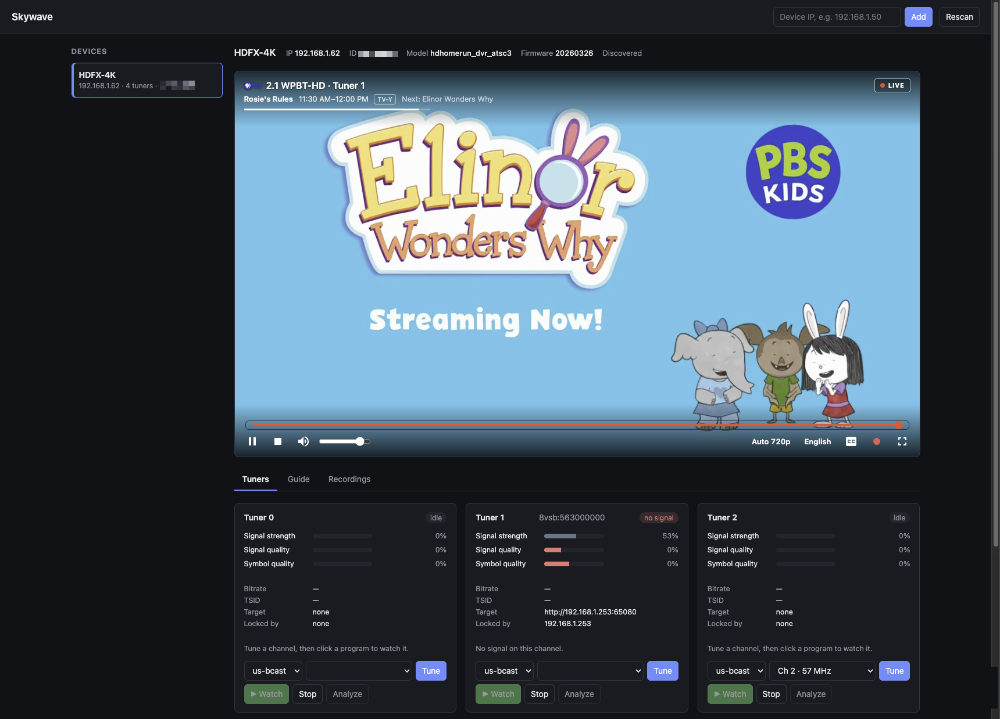
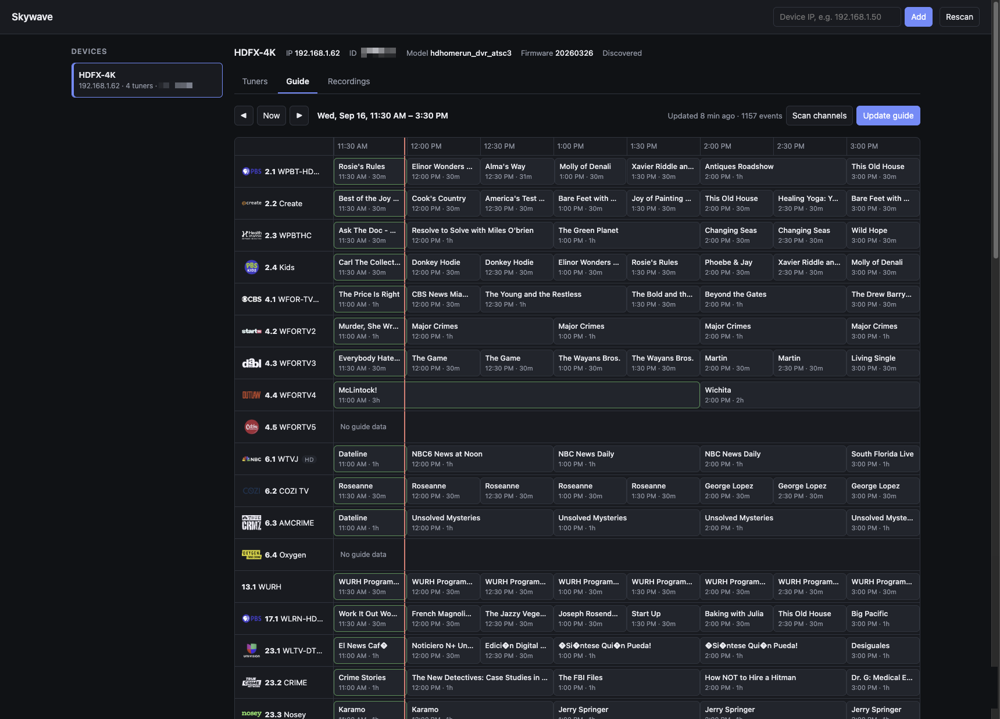
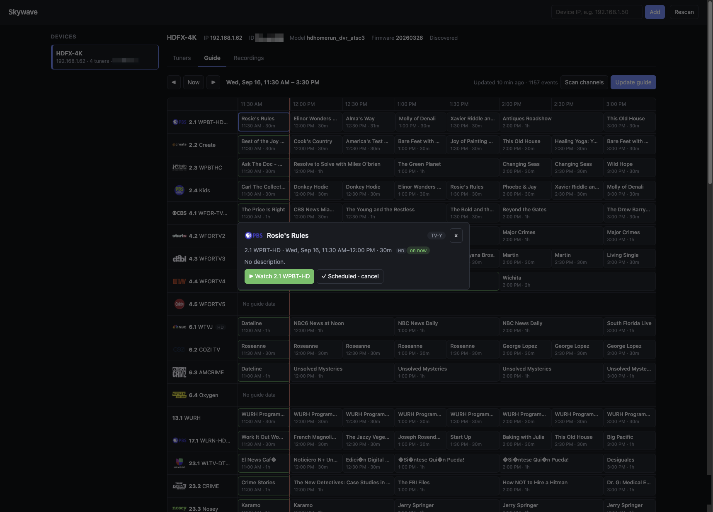
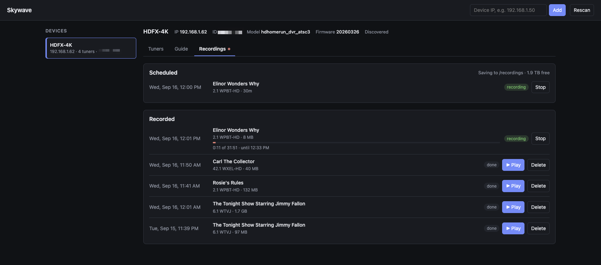

# Skywave

Live TV, a program guide and recordings from an over-the-air antenna, in any browser on
your network. Skywave drives HDHomeRun tuners, reads the guide out of the broadcast
itself, and records to a disk you choose. Once it is running, nothing it does needs an
internet connection.

- **Watch** any channel your antenna receives, on a phone, tablet or desktop, with closed
  captions, alternate audio tracks, several picture sizes and a rewind window.
- **Browse** what is on, read from the broadcast's own guide tables, with station logos.
- **Record** a program from the guide and play it back in the same player.
- **Analyze** the transport stream itself: programs, bitstreams and tables.

Start it with [Docker](#docker), or run it straight from PHP.

## Screenshots

Watching a channel. The overlay carries the station's logo, what is on now and what is
next, a seek bar over the rewind window, and the controls for picture size, audio track,
captions and recording.



The guide, read from the broadcast itself rather than from a service, with station logos
and HD marked.



A programme's details, from where it can be watched or recorded.



Recordings, with one in progress. The dot on the tab pulses wherever you are in the page
while something is being recorded.



## HDHomeRun

A pure PHP client for HDHomeRun tuners lives in `src/Hdhomerun/`: discovery, get/set
control, tuner status, tuning, locking and channel maps. It speaks the same protocol as
Silicondust's libhdhomerun, so no C library or PHP extension is needed.

### Command line

```bash
php hdhomerun.php discover
php hdhomerun.php 192.168.1.50 info
php hdhomerun.php 192.168.1.50 status
php hdhomerun.php 192.168.1.50 tune 0 auto:33
php hdhomerun.php 192.168.1.50 get /sys/features
```

### Web UI

Lists tuners, shows live signal and programs, tunes channels and analyzes the tuned
channel's stream (programs, bitstreams and guide).

```bash
PHP_CLI_SERVER_WORKERS=4 php -S 0.0.0.0:8080 -t public public/index.php
```

Several workers keep status updates flowing while an analysis (about 10 seconds) runs.
Broadcast discovery only finds tuners on the same network; list others with
`HDHOMERUN_DEVICES=192.168.1.50,10.0.0.7` or add them by IP in the page.

A device added in the page is remembered by the server, next to the guide, so every
browser sees it, including a phone that has never been used to add one. Removing it in one
browser removes it everywhere. `HDHOMERUN_DEVICES` still works and cannot be removed from
the page, which makes it the right place for a tuner that must always be listed.

**Rescan** broadcasts for tuners and also asks every address on the networks it has reason
to look at, which takes about a second. That second part matters in Docker: a broadcast
never leaves the container on Docker Desktop, so scanning there used to find nothing at
all.

The networks it searches are those of the devices it already knows, and the one the page
was opened from: a browser reaching the server at `192.168.1.253` has named the network its
tuners are on, which is what makes scanning work before any device is known. Opening the
page at `localhost` says nothing about the network, so from there the first device still has
to be added by address.

The API only accepts private, loopback and link-local device addresses, and it has no
authentication: keep it on a trusted network.

### Live playback

Click a program in a tuned tuner's card to watch it. Browsers cannot play broadcast
MPEG-2 video or AC-3 audio, so ffmpeg (required on the server) converts the program to
H.264 and AAC and serves it as HLS, played with hls.js. Several viewers of the same
program share one conversion; it stops, and the tuner returns to its channel, about
30 seconds after the last viewer leaves.

Each program is encoded at several sizes at once (`HLS_RENDITIONS`, 720p, 480p and 360p by
default), and the player switches between them as the connection speeds up or slows down,
so it keeps playing over mobile data. SD channels get proportionally smaller sizes (480,
320, 240). Measured live on a 1080i channel with an 8-thread desktop processor:

| `HLS_RENDITIONS` | CPU threads per stream | Typical bitrates |
|---|---|---|
| `720` | 1.7 | 1.7 Mbps |
| `720,480,360` (default) | 2.9 | 1.7 / 1.0 / 0.6 Mbps |
| `1080,720,480,360` | 3.8 | 3.3 / 1.7 / 1.0 / 0.6 Mbps |

Bitrates are capped for busy scenes: 7, 3.5, 1.5 and 0.8 Mbps for 1080p, 720p, 480p and
360p video.

The player has its own controls: channel and current program (from the guide), a seek
bar over the rewind window (`HLS_DVR_MINUTES`, 5 by default), live indicator (click it
to catch up), play/pause, volume, quality (Auto, or a fixed size that the browser
remembers), closed captions (CEA-608, when the broadcast carries them), full screen, and
a record button that records the program now airing, on a tuner of its own so watching
carries on. Keyboard: space or K
play/pause, left/right arrows 10 seconds back/forward, M mute, C captions, F full screen.
The window starts empty when a stream starts and fills as it plays.

Captions survive the conversion because the transcoder deinterlaces one frame at a time
(`estdif`) and keeps the broadcast's frame timing; temporal deinterlacers and constant
frame rate output duplicate or reorder the caption data carried in each frame.

### Program guide

The Guide tab shows what is on, read from the broadcast's own guide tables (ATSC EIT/ETT,
usually the next 12 hours). **Scan channels** finds the channels a device receives;
**Update guide** reads each channel for about 10 seconds, using only idle tuners. Click a
program for details and to watch its channel. Data lives in SQLite (`data/guide.sqlite`).

```bash
php tools/guide.php scan 192.168.1.50
php tools/guide.php collect 192.168.1.50
php tools/guide.php show 192.168.1.50 --hours=6
php tools/guide.php run --interval=240     # keep every known device up to date
```

In Docker the `guide` service runs `run` and shares the database volume with the web UI.

### Station logos

A broadcast names its channels but never pictures them, so logos come from the device
maker's service, which is the one reliable source for them:

```bash
php tools/guide.php logos 192.168.1.50 [--force]
```

They are fetched once, written next to the guide database, and served from there, so a
page never reaches the internet; a channel scan refreshes them too. Channels without a
logo show their name instead, and with no internet at all everything works exactly as
before. Logos are matched by channel number, never by name: the service calls 4.1 WFORDT
where the broadcast calls it WFOR-TV.

The guide itself stays local, read from the broadcast, so nothing about watching, the
guide or recording depends on an internet connection.

### Recordings

Click a program in the Guide and choose **Record** to schedule that showing; the
Recordings tab lists what is scheduled and what has been recorded. The `recorder` service
starts and stops them on time, so the page does not have to be open.

```bash
php tools/recorder.php run --tick=10     # start and stop recordings as they come due
php tools/recorder.php list              # what is scheduled and what has been recorded
php tools/recorder.php stop <id>         # stop one early, keeping the file
```

A recording reserves its tuner for as long as it runs: live playback and guide updates
skip that tuner instead of retuning it mid-recording. `RECORDING_PAD_START` and
`RECORDING_PAD_END` add a margin around each program for broadcasts that run late.

`RECORDING_FORMAT` decides what lands on disk. `ts` writes the broadcast exactly as it was
sent, which costs no CPU and keeps the original quality and captions (about 1-4 GB an
hour), and `mp4` converts while recording (about 2-3 CPU threads) for a file browsers play
directly. Recordings are written to `RECORDINGS_DIR`, which must stay available: a folder
on an external drive that is unplugged or asleep fails the recording with a clear reason
rather than writing a broken file.

Nothing is ever deleted for you. The Recordings tab shows how much room is left and says
so when it runs low, and a recording refuses to start with less than 2 GB free; making
room is left to you, because a recording deleted automatically is only missed afterwards.

`both` records the broadcast untouched and then converts a browser-ready copy once the
program ends, so no tuner time is spent on conversion and the original is kept. The copy is
made in the background (about 20 times faster than playback) and used for playback when it
is ready; until then the recording plays like any other `ts`.

**Play** in the Recordings tab plays one back in the same player, with a seek bar over the
whole recording. An `mp4` plays straight from the file. A `ts` recording holds MPEG-2 video
and AC-3 audio, which no browser decodes, so the server converts it to HLS while you watch:
conversion runs about 20 times faster than playback, so it starts within seconds and you
can seek anywhere already converted. Those segments live in a hidden `.playback` folder
beside the recordings and are deleted a minute after the last viewer stops watching.

### Logs

The Logs tab shows what the services wrote down, so a failed recording or a guide scan
that went wrong can be read without a terminal:

- **Web requests** — every request nginx served, with its status and the browser that
  asked.
- **Recorder** and **Guide** — what those services are doing between jobs.
- **Each recording** and **each live stream** — the transcoder's own output, which is
  where a recording that stopped early explains itself.

The page asks for a log by name from a fixed list, never by path, and each one is read
from its end so a large file costs no more to open than a small one.

Two things are worth knowing. Nothing rotates the request log, so it is emptied at startup
if it has grown past 16 MB (roughly a fortnight at a few thousand requests a day). And in
Docker the client address is always the gateway's, because published ports hide the real
one: to see who is connecting, read the address your proxy reports rather than this log.

### Simulator (no hardware needed)

```bash
php tools/fake-hdhomerun.php --verbose
php tools/fake-hdhomerun.php --capture=~/Desktop/capture.ts --capture-channel=33
```

Answers discovery, control and HTTP streaming (port 5004) on 127.0.0.1 like a real
device. With `--capture`, a raw MPEG-TS recording is broadcast on one channel with its
real lineup and replayed in a loop at its original bitrate; other channels have no signal.
Use `--bind=0.0.0.0` to make it discoverable by broadcast.

## Analyzer (command line)

The parser this project grew out of, run over a capture or straight off a tuner. Prints
the programs, bitstreams and tables it finds.

```bash
php analyze.php capture.ts
php analyze.php 'http://<hdhomerun-ip>:5004/auto/ch33?duration=30'
```

## Docker

One image runs nginx and php-fpm as a non-root user, with HTTP basic auth in front of
the UI and API. ffmpeg is included for live playback (`--build-arg WITH_FFMPEG=0` to
leave it out).

```bash
cp .env.example .env              # set AUTH_PASSWORD
docker compose up -d --build
```

Open `http://<this-machine>:8090` and sign in as `admin`. The container uses host
networking so broadcast discovery can reach tuners on your LAN.

Everything the page remembers — the channel scan, the guide, station logos, and every
scheduled and past recording — lives in the `guide-data` Docker volume, not in the project
folder. `docker compose down` keeps it. **`docker compose down -v` deletes it**, taking the
guide and every schedule with it. The recordings themselves are safe either way: they live
in `RECORDINGS_DIR`.

Without a tuner, set `CAPTURE_FILE` in `.env` to a raw MPEG-TS recording and start the
simulator too, then add device `127.0.0.1` in the page:

```bash
docker compose --profile simulator up -d --build
```

Settings (environment variables):

| Variable | Default | Purpose |
|---|---|---|
| `AUTH_PASSWORD` / `AUTH_PASSWORD_FILE` | (required) | Sign-in password, or a file holding it (Docker secrets) |
| `AUTH_USER` | `admin` | Sign-in user name |
| `AUTH_DISABLED` | | `1` runs without a password; only on a network you fully trust |
| `HTTP_PORT` | `8090` in compose, `8080` in the image | Port nginx listens on |
| `HDHOMERUN_DEVICES` | | Tuner IPs discovery cannot find, comma separated |
| `MAX_STREAMS` | `2` | Programs that can play at once (one ffmpeg each) |
| `HLS_RENDITIONS` | `720,480,360` | Picture heights offered to players, up to 4 (`1080,720,480,360` keeps full HD channels in full HD) |
| `HLS_DVR_MINUTES` | `5` | How far back a live stream can be rewound (kept in memory in Docker, for every rendition) |
| `HLS_VIEWER_TIMEOUT` | `30` | Seconds without a viewer before a stream stops |
| `GUIDE_INTERVAL` | `240` | Minutes between automatic guide updates (guide service) |
| `GUIDE_DB` | `/data/guide.sqlite` | Guide database (`data/guide.sqlite` outside Docker), which also holds recordings |
| `RECORDINGS_DIR` | `./data/recordings` | Folder for recordings, mounted at `/recordings` in the containers |
| `RECORDING_FORMAT` | `ts` | What to keep by default: `ts` as broadcast, `mp4` converted while recording, `both` (converted after it ends); each recording can override it |
| `RECORDING_HEIGHT` | `720` | Picture height for `mp4` recordings |
| `RECORDING_PLAYBACK_HEIGHT` | `720` | Picture height when converting a `ts` recording for watching |
| `RECORDING_PAD_START` / `RECORDING_PAD_END` | `60` / `180` | Seconds recorded before and after a program |
| `RECORDER_TICK` | `10` | Seconds between recorder checks for due recordings |

On Docker Desktop (macOS, Windows), host networking is limited: its port forwarding does
not come back after Docker Desktop restarts, and broadcast discovery will not reach your
LAN. Add the override, which publishes the port instead, and list the tuners in
`HDHOMERUN_DEVICES` or add them by IP in the page:

```bash
echo 'COMPOSE_FILE=docker-compose.yml:docker-compose.macos.yml' >> .env
docker compose up -d --build
```

On macOS, also allow Docker in System Settings → Privacy & Security → Local Network,
then restart Docker Desktop; without it, connections to tuners fail with "no route to host".

For access from outside your home, put the container behind a VPN (WireGuard,
Tailscale) or an HTTPS reverse proxy. Basic auth over plain HTTP sends the password
readable to anyone on the path.

## Limitations

- **One viewer per tuner.** Two people cannot share a tuner, so a four-tuner device serves
  four programs at once, recordings included. Skywave picks a free tuner and says so
  plainly when there is none.
- **ATSC 1.0 only.** ATSC 3.0 channels appear in a scan but cannot be watched or recorded:
  the device does not send them as MPEG-TS.
- **Nothing is ever deleted for you.** The Recordings tab warns when the drive runs low and
  refuses to start a recording below 2 GB free, but making room is yours to do.
- **Every conversion runs on this machine.** HDHomeRun tuners do not transcode, so each
  viewer watching a different program costs CPU here.
- **One showing at a time.** Recordings are scheduled per showing; there is no series rule
  yet.
- **The guide comes from the broadcast**, so it reaches about 12 hours ahead and covers
  only what your antenna receives. Station logos are the one thing fetched from the
  internet, once, and then served locally.

## License

MIT, see [LICENSE](LICENSE).
