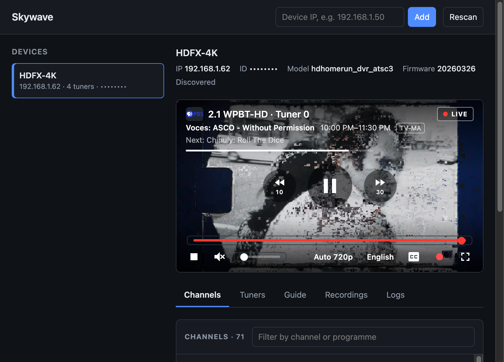
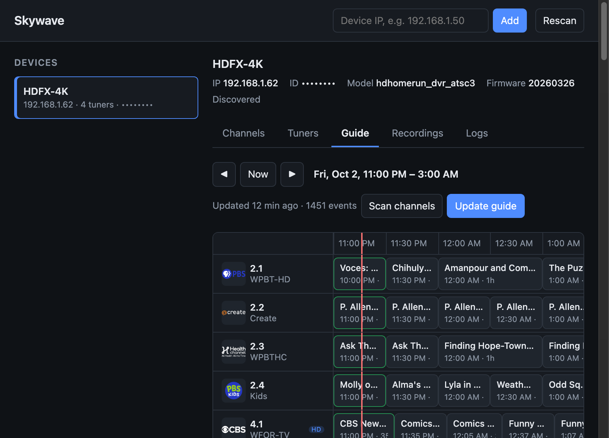
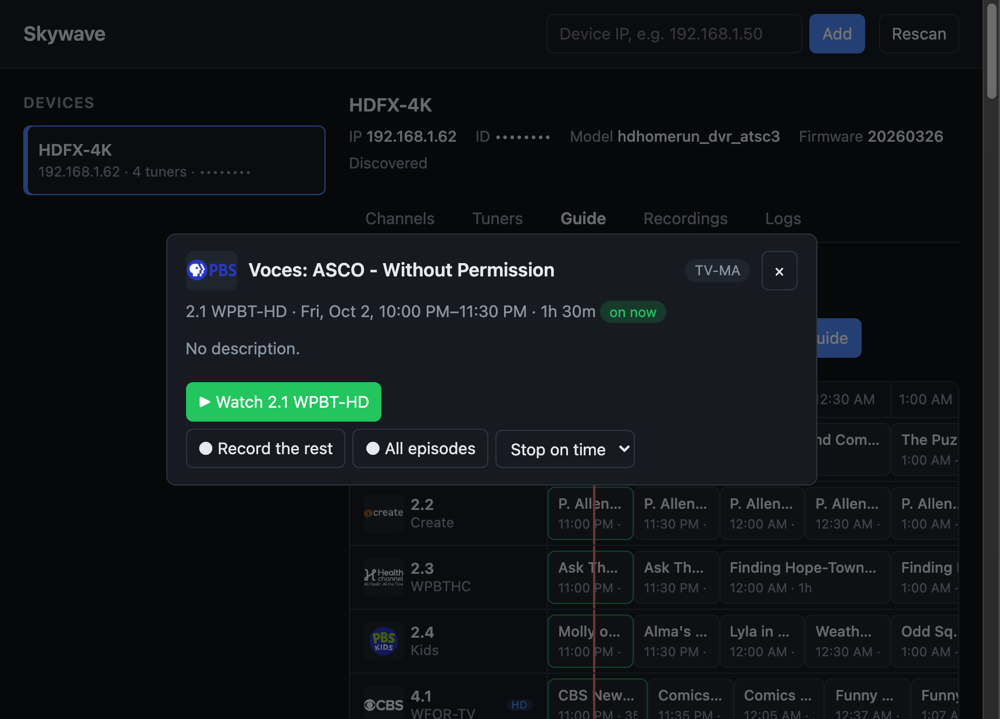
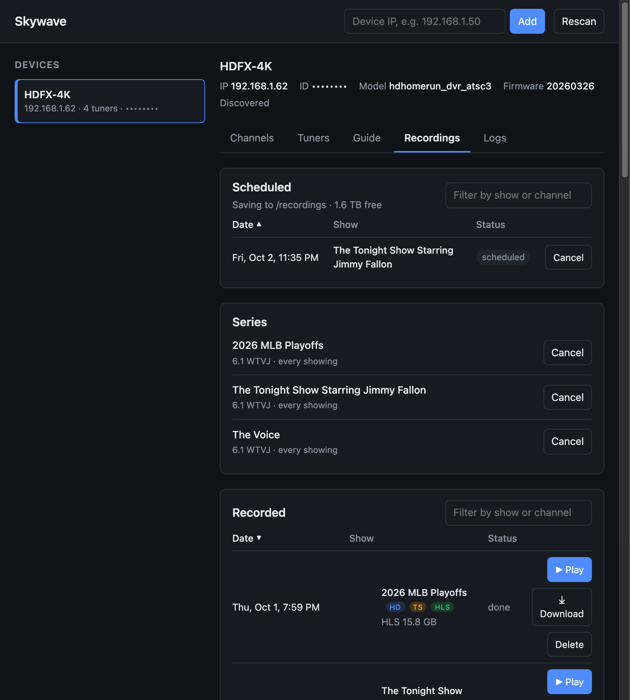

# Skywave

Live TV, a program guide and recordings from an over-the-air antenna, in any browser on
your network. Skywave drives HDHomeRun tuners, reads the guide out of the broadcast
itself, and records to a disk you choose. Once it is running, nothing it does needs an
internet connection.

- **Watch** any channel your antenna receives, on a phone, tablet or desktop, with closed
  captions, alternate audio tracks, several picture sizes and a rewind window.
- **Browse** what is on, read from the broadcast's own guide tables, with station logos.
- **Record** a program from the guide and play it back in the same player.
- **Analyze** the transport stream itself: programs, bitstreams and tables.
- **Listen** to HD Radio stations through an RTL-SDR dongle, with the station's name and
  what is playing. This part is optional and needs [nrsc5](#hd-radio).

Start it with [Docker](#docker), or run it straight from PHP.

## Screenshots

Watching a channel. The overlay carries the station's logo, what is on now and what is
next, a seek bar over the rewind window, and the controls for picture size, audio track,
captions and recording.



The guide, read from the broadcast itself rather than from a service, with station logos
and HD marked.



A programme's details, from where it can be watched or recorded.



Recordings, with one in progress. The dot on the tab pulses wherever you are in the page
while something is being recorded.



## HDHomeRun

A pure PHP client for HDHomeRun tuners lives in `src/Hdhomerun/`: discovery, get/set
control, tuner status, tuning, locking and channel maps. It speaks the same protocol as
Silicondust's libhdhomerun, so no C library or PHP extension is needed.

### Command line

```bash
php hdhomerun.php discover
php hdhomerun.php 192.168.1.50 info
php hdhomerun.php 192.168.1.50 status
php hdhomerun.php 192.168.1.50 tune 0 auto:33
php hdhomerun.php 192.168.1.50 get /sys/features
```

### Web UI

Lists tuners, shows live signal and programs, tunes channels and analyzes the tuned
channel's stream (programs, bitstreams and guide).

```bash
PHP_CLI_SERVER_WORKERS=4 php -S 0.0.0.0:8080 -t public public/index.php
```

Several workers keep status updates flowing while an analysis (about 10 seconds) runs.
Broadcast discovery only finds tuners on the same network; list others with
`HDHOMERUN_DEVICES=192.168.1.50,10.0.0.7` or add them by IP in the page.

A device added in the page is remembered by the server, next to the guide, so every
browser sees it, including a phone that has never been used to add one. Removing it in one
browser removes it everywhere. `HDHOMERUN_DEVICES` still works and cannot be removed from
the page, which makes it the right place for a tuner that must always be listed.

**Rescan** broadcasts for tuners and also asks every address on the networks it has reason
to look at, which takes about a second. That second part matters in Docker: a broadcast
never leaves the container on Docker Desktop, so scanning there used to find nothing at
all.

The networks it searches are those of the devices it already knows, and the one the page
was opened from: a browser reaching the server at `192.168.1.253` has named the network its
tuners are on, which is what makes scanning work before any device is known. Opening the
page at `localhost` says nothing about the network, so from there the first device still has
to be added by address.

The API only accepts private, loopback and link-local device addresses, and it has no
authentication: keep it on a trusted network.

### Live playback

Click a program in a tuned tuner's card to watch it. Browsers cannot play broadcast
MPEG-2 video or AC-3 audio, so ffmpeg (required on the server) converts the program to
H.264 and AAC and serves it as HLS, played with hls.js. Several viewers of the same
program share one conversion; it stops, and the tuner returns to its channel, about
30 seconds after the last viewer leaves.

Each program is encoded at several sizes at once (`HLS_RENDITIONS`, 720p, 480p and 360p by
default), and the player switches between them as the connection speeds up or slows down,
so it keeps playing over mobile data. SD channels get proportionally smaller sizes (480,
320, 240). Measured live on a 1080i channel with an 8-thread desktop processor:

| `HLS_RENDITIONS` | CPU threads per stream | Typical bitrates |
|---|---|---|
| `720` | 1.7 | 1.7 Mbps |
| `720,480,360` (default) | 2.9 | 1.7 / 1.0 / 0.6 Mbps |
| `1080,720,480,360` | 3.8 | 3.3 / 1.7 / 1.0 / 0.6 Mbps |

Bitrates are capped for busy scenes: 7, 3.5, 1.5 and 0.8 Mbps for 1080p, 720p, 480p and
360p video.

The player has its own controls: channel and current program (from the guide), a seek
bar over the rewind window (`HLS_DVR_MINUTES`, 5 by default), live indicator (click it
to catch up), play/pause, volume, quality (Auto, or a fixed size that the browser
remembers), closed captions (CEA-608, when the broadcast carries them), full screen, and
a record button that records the program now airing, on a tuner of its own so watching
carries on. Keyboard: space or K
play/pause, left/right arrows 10 seconds back/forward, M mute, C captions, F full screen.
The window starts empty when a stream starts and fills as it plays.

Captions survive the conversion because the transcoder deinterlaces one frame at a time
(`estdif`) and keeps the broadcast's frame timing; temporal deinterlacers and constant
frame rate output duplicate or reorder the caption data carried in each frame.

### Program guide

The Guide tab shows what is on, read from the broadcast's own guide tables (ATSC EIT/ETT,
usually the next 12 hours). **Scan channels** finds the channels a device receives;
**Update guide** reads each channel for about 10 seconds, using only idle tuners. Click a
program for details and to watch its channel. Data lives in SQLite (`data/guide.sqlite`).

```bash
php tools/guide.php scan 192.168.1.50
php tools/guide.php collect 192.168.1.50
php tools/guide.php show 192.168.1.50 --hours=6
php tools/guide.php run --interval=240     # keep every known device up to date
```

In Docker the `guide` service runs `run` and shares the database volume with the web UI.

### ATSC 3.0

Channels broadcast in ATSC 3.0 are listed with the rest, badged `3.0` and either `DRM` or
`OTT`. They carry no guide tables of their own, so they show the programmes of the 1.0
channel they simulcast: 106.1 shows what 6.1 is showing. A station with no counterpart on
air stays empty rather than being given something invented.

Most cannot be played. An encrypted station is refused: the device will not serve it to
anything uncertified. A station whose broadcaster sends the video over the internet can be
watched, when the broadcast says where, and plays **without sound** — its audio is AC-4,
which no released ffmpeg decodes. You can build one yourself; see
[AC-4 audio](#ac-4-audio). Those need no tuner at all, so they never compete with a
recording. None of them can be recorded.

A row with no programmes never opens the details panel, so it carries a play button where
the listings would be. The same button appears on 1.0 channels that broadcast no guide
data, which otherwise could not be watched at all.

### Station logos

A broadcast names its channels but never pictures them, so logos come from the device
maker's service, which is the one reliable source for them:

```bash
php tools/guide.php logos 192.168.1.50 [--force]
```

They are fetched once, written next to the guide database, and served from there, so a
page never reaches the internet; a channel scan refreshes them too. Channels without a
logo show their name instead, and with no internet at all everything works exactly as
before. Logos are matched by channel number, never by name: the service calls 4.1 WFORDT
where the broadcast calls it WFOR-TV.

The guide itself stays local, read from the broadcast, so nothing about watching, the
guide or recording depends on an internet connection.

### Programme pictures

A broadcast names what is on but never pictures it, the same gap the station logos fill.
Pictures come from [TVmaze](https://www.tvmaze.com), which needs no account and no key, and
are fetched during a guide update rather than when a page loads, so nobody waits on someone
else's service.

They are matched on the title exactly, because a title is all the air carries. Nothing
fuzzy: showing the wrong programme's picture would be worse than showing none, and a good
half of what a broadcast lists is "Paid Programming" or a channel's own name. Titles TVmaze
does not know are remembered as misses for a month, so a channel running the same filler two
dozen times a day is looked up once rather than two dozen times.

Pictures are written beside the guide database and served from there. With no internet,
nothing is fetched and everything else works exactly as before.

### Recordings

Click a program in the Guide and choose **Record** to schedule that showing; the
Recordings tab lists what is scheduled and what has been recorded. The `recorder` service
starts and stops them on time, so the page does not have to be open.

```bash
php tools/recorder.php run --tick=10     # start and stop recordings as they come due
php tools/recorder.php list              # what is scheduled and what has been recorded
php tools/recorder.php stop <id>         # stop one early, keeping the file
```

A recording reserves its tuner for as long as it runs: live playback and guide updates
skip that tuner instead of retuning it mid-recording. `RECORDING_PAD_START` and
`RECORDING_PAD_END` add a margin around every program for broadcasts that run late.

Sport needs more than a margin. A ball game scheduled for three hours regularly runs twenty
minutes past it, and the broadcast guide is no help: the listing keeps its planned length
however late the game ends, and the programmes after it keep their planned times, so there
is nothing to read that says it overran. So the record buttons carry a **stop late** choice
-- on time, or 15, 30 or 60 minutes after the listing says it ends. Choose it against a
single showing, or against **All episodes** and every showing of that series gets it. It is
only worth spending where a programme actually overruns: the recording holds its tuner for
the whole of the extra time.

Every recording keeps two things, and there is nothing to choose. The broadcast is written
exactly as it was sent, which costs no CPU and keeps the original quality and captions
(about 1-4 GB an hour); then, once the program ends, a copy a browser can play is made from
it. Recordings are written to `RECORDINGS_DIR`, which must stay available: a folder on an
external drive that is unplugged or asleep fails the recording with a clear reason rather
than writing a broken file.

Nothing is ever deleted for you. The Recordings tab shows how much room is left and says
so when it runs low, and a recording refuses to start with less than 2 GB free; making
room is left to you, because a recording deleted automatically is only missed afterwards.

Converting after the program ends rather than during it means no tuner time is spent on it
and the original is always kept. The copy is made in the background, and until it is ready
the recording plays by converting on the fly, as it always did. One copy is made at a time,
so several programs ending in the same minute queue instead of competing for the machine.

`RECORDING_CONVERT_TO` chooses what that copy is. `hls`, the default, writes a finished
playlist and the sizes in `RECORDING_PLAYBACK_RENDITIONS`: the full length and a working
seek bar the moment it opens, nothing transcoding while you watch, and a smaller picture to
fall back on from outside the house. It is stereo, because a browser will not reliably
decode 5.1, and it is a directory rather than a single file. `mp4` writes one file instead,
close to the broadcast and with its surround sound intact. Either way the broadcast is
untouched, and it is the one to open at home when you want exactly what was aired.

If you ran an earlier version, `RECORDING_FORMAT` no longer does anything and can be
deleted; one left in place is ignored. Two things change for you. Recordings kept as `ts`
now also get a browser copy, which costs roughly a third of each program's duration in
background CPU and rather more disk than an mp4 of the same program. And `mp4` no longer
records by transcoding as it goes -- the broadcast is always written as sent, so nothing
records without an original any more. Recordings already on disk are untouched and still
play, whichever way they were made.

**Download** saves a recording to whatever machine you are on. When the copy is a playlist
it offers the sizes in it as well as the broadcast: a 720p rung of an hour of 1080i runs to
about a third of what the broadcast does, and it is H.264 and AAC, which a phone will play
where MPEG-2 and AC-3 will not.

A size arrives as an mp4 holding the picture and the sound together. In the playlist they
are separate -- the languages live in renditions of their own, which is what lets the player
offer them -- so the two are put back into one container as the download is sent. Nothing is
re-encoded; it is a stream copy, and a programme takes well under a second of it. What it
costs is that the file is made as it goes, so the browser shows no total and cannot resume
it. The broadcast itself is a file on disk, and downloading that does resume.

The broadcast is also the only copy with the surround sound and the picture exactly as
aired; the sizes are stereo.

**Convert** makes a browser-ready copy of a recording kept as broadcast, which is worth doing
for the room it saves. Measured on a 1080i broadcast here: an hour takes about 2.8 GB as
sent, 1.5 GB converted at the same picture size, and 0.6 GB converted to 720p. The recorder
does it in the background, about four times faster than watching it, and checks the result
plays before keeping it. Nothing is deleted either way: the broadcast stays until you remove
it yourself.

The player puts **play and two jumps** in the middle of the picture -- ten seconds back,
thirty forward -- where a thumb lands. Thirty is the commercial-break length people actually
tap through, and the arrow keys still nudge ten either way for finding an exact moment. The
buttons are the only way to skip on a phone, which has no arrow keys. The bar underneath
keeps stop, the volume and the rest.

Tapping the picture puts the controls away and brings them back. A tap that brings them back
never also presses what it landed on: a phone makes up mouse events for a tap, which used to
reveal the controls mid-press and hand the tap to whatever button was underneath.

On a narrow screen the picture size, audio track and captions move behind a cog at the right
of the controls: three named controls and the buttons do not fit on one line on a phone, and
squeezing them shrank the jump arrows to nothing. On a wide screen they stay in the row and
there is no cog.

**Play** in the Recordings tab plays one back in the same player, with a seek bar over the
whole recording. An `mp4` plays straight from the file. A `ts` recording holds MPEG-2 video
and AC-3 audio, which no browser decodes, so the server converts it to HLS while you watch:
conversion runs about 20 times faster than playback, so it starts within seconds and you
can seek anywhere already converted. Those segments live in a hidden `.playback` folder
beside the recordings and are deleted a minute after the last viewer stops watching.

### Series

**Record all episodes** in a program's details keeps recording it. A broadcast carries only
about twelve hours of guide, so nothing can be scheduled a week ahead: the rule is kept
instead, and every guide update schedules whatever has just come into view and matches. A
listing that changes next week is never wrong, because nothing was claimed about next week.

What a rule can match is limited by what the air carries. ATSC has no series identifier and
no repeat flag, and here only about one event in twenty carries a description, so a rule
matches **a title on a channel** — every showing of it.

A rule can also be narrowed to a range of hours and a set of weekdays, which is how you take
the evening showing and leave the small-hours repeat alone:

> Jeopardy!, on 6.1, weekdays between 18:00 and 20:00

The page does not offer that yet; for now it is set through `POST /api/recordings/rules`
with `earliest`, `latest` (minutes past midnight) and `days` (1 is Monday). Hours are read in
the time zone of the browser that made the rule, so they keep meaning the same thing when the
clocks change.

A showing already scheduled, recorded or cancelled is never picked up again, and asking for
the same series twice makes one rule, not two. One rule schedules at most eight showings in a
single pass: some channels run the same programme all afternoon, and one press should not
take every tuner. The rest are picked up by later passes, as the earlier ones finish.

Rules are listed in the Recordings tab, where they can be cancelled. Cancelling one leaves
the recordings it already made, and any showing already scheduled.

### Logs

The Logs tab shows what the services wrote down, so a failed recording or a guide scan
that went wrong can be read without a terminal:

- **Web requests** — every request nginx served, with its status and the browser that
  asked.
- **Recorder** and **Guide** — what those services are doing between jobs.
- **Each recording** and **each live stream** — the transcoder's own output, which is
  where a recording that stopped early explains itself.
- **Each radio station** being played — what nrsc5 said about it, which is where a
  station that will not play explains itself.

The page asks for a log by name from a fixed list, never by path, and each one is read
from its end so a large file costs no more to open than a small one.

Two things are worth knowing. Nothing rotates the request log, so it is emptied at startup
if it has grown past 16 MB (roughly a fortnight at a few thousand requests a day). And in
Docker the client address is always the gateway's, because published ports hide the real
one: to see who is connecting, read the address your proxy reports rather than this log.

### Simulator (no hardware needed)

```bash
php tools/fake-hdhomerun.php --verbose
php tools/fake-hdhomerun.php --capture=~/Desktop/capture.ts --capture-channel=33
```

Answers discovery, control and HTTP streaming (port 5004) on 127.0.0.1 like a real
device. With `--capture`, a raw MPEG-TS recording is broadcast on one channel with its
real lineup and replayed in a loop at its original bitrate; other channels have no signal.
Use `--bind=0.0.0.0` to make it discoverable by broadcast.

## HD Radio

Digital FM stations, received with an RTL-SDR dongle rather than an HDHomeRun, which
cannot tune the FM band. The radio appears in the device list beside the tuners: enter a
frequency, press Listen, and it plays in the same player, with the same rewind window.

A dongle is nothing like a tuner. It hands over raw radio samples and does none of the
work, so everything between those samples and sound is software:
[nrsc5](https://github.com/theori-io/nrsc5) demodulates the station and decodes its audio,
and ffmpeg turns that into the HLS a browser plays. Skywave starts the two, joins them, and
reads what nrsc5 says about the station as it goes: its name and slogan, the title and
artist, how strong the signal is, which programs it carries (HD1, HD2 and so on), and the
album cover or logo when it sends one.

It is off until it is told where the dongle is:

| Variable | Purpose |
|---|---|
| `RADIO_RTL_TCP` | A dongle shared over the network by `rtl_tcp`, as `host` or `host:port` (1234 when not given) |
| `RADIO_DEVICE` | A dongle plugged into this machine, counting from `0` |
| `RADIO_GAIN` | Tuner gain in dB. Left empty, nrsc5 finds one itself each time a station starts |
| `RADIO_PPM` | The dongle's frequency error in parts per million, for one that is off |
| `RADIO_SCAN_SECONDS` | How long a scan waits on each frequency, 6 by default. Longer finds weaker stations; shorter gets through the empty ones faster |
| `NRSC5` | Path to nrsc5, when it is not on `PATH` |

```bash
RADIO_DEVICE=0 PHP_CLI_SERVER_WORKERS=4 php -S 0.0.0.0:8080 -t public public/index.php
```

`rtl_tcp` is only needed when the dongle is somewhere Skywave is not: on another machine,
or on the host while Skywave runs in a container that cannot be given the USB device. It
serves one listener at a time, and so does a dongle opened directly.

Nothing on the FM band announces what else is on it, so the only station list there can
be is the one made by listening. A station is kept as a button once it has been played, in
the guide's database, so every browser and phone sees the same ones; the × beside it
forgets it.

**Scan** finds them for you, the only way there is: by pointing nrsc5 at each frequency in
turn and waiting to see whether it locks on. The dial is 101 frequencies (the odd tenths,
87.9 to 107.9) and most are empty, each costing the whole wait, so a full scan takes about
ten minutes. It runs in the background and can be stopped; what it has found by then is
kept. It needs the dongle to itself, so nothing can be listened to while it runs, and it
will not start while somebody else is listening. From a terminal:

```bash
php tools/radio-scan.php                         # the whole dial
php tools/radio-scan.php --from=88.1 --to=92.1   # part of it
```

In Docker, see [HD Radio](#hd-radio-1) under Docker: nrsc5 is built separately.

### Radio simulator (no hardware needed)

```bash
php tools/fake-rtl-tcp.php --verbose
php tools/fake-rtl-tcp.php --capture=~/sample.cu8 --capture-frequency=90.5
RADIO_RTL_TCP=127.0.0.1 php -S 0.0.0.0:8080 -t public public/index.php
```

Speaks `rtl_tcp` on 127.0.0.1:1234 like a shared dongle, so nrsc5 talks to it as it would
to the real thing. With `--capture`, a recording of raw I/Q samples becomes the only
station on the dial, replayed in a loop at the speed it was recorded; every other
frequency is noise, which leaves nrsc5 searching exactly as an empty channel would.

A capture is what `nrsc5 -w FILE` writes: unsigned 8-bit I and Q at 1,488,375 samples a
second. The nrsc5 source ships seventeen seconds of one, compressed:

```bash
xz -dk -c nrsc5/support/sample.xz > ~/sample.cu8
```

The station drops out for a moment each time the recording starts over.

## Analyzer (command line)

The parser this project grew out of, run over a capture or straight off a tuner. Prints
the programs, bitstreams and tables it finds.

```bash
php analyze.php capture.ts
php analyze.php 'http://<hdhomerun-ip>:5004/auto/ch33?duration=30'
```

## Docker

One image runs nginx and php-fpm as a non-root user, with HTTP basic auth in front of
the UI and API. ffmpeg is included for live playback (`--build-arg WITH_FFMPEG=0` to
leave it out).

```bash
cp .env.example .env              # set AUTH_PASSWORD
docker compose up -d --build
```

Open `http://<this-machine>:8090` and sign in as `admin`. The container uses host
networking so broadcast discovery can reach tuners on your LAN.

Everything the page remembers — the channel scan, the guide, station logos, and every
scheduled and past recording — lives in the `guide-data` Docker volume, not in the project
folder. `docker compose down` keeps it. **`docker compose down -v` deletes it**, taking the
guide and every schedule with it. The recordings themselves are safe either way: they live
in `RECORDINGS_DIR`.

Without a tuner, set `CAPTURE_FILE` in `.env` to a raw MPEG-TS recording and start the
simulator too, then add device `127.0.0.1` in the page:

```bash
docker compose --profile simulator up -d --build
```

Settings (environment variables):

| Variable | Default | Purpose |
|---|---|---|
| `AUTH_PASSWORD` / `AUTH_PASSWORD_FILE` | (required) | Sign-in password, or a file holding it (Docker secrets) |
| `AUTH_USER` | `admin` | Sign-in user name |
| `AUTH_DISABLED` | | `1` runs without a password; only on a network you fully trust |
| `HTTP_PORT` | `8090` in compose, `8080` in the image | Port nginx listens on |
| `HDHOMERUN_DEVICES` | | Tuner IPs discovery cannot find, comma separated |
| `MAX_STREAMS` | `2` | Programs that can play at once (one ffmpeg each) |
| `FFMPEG` | `ffmpeg` | Path to ffmpeg, when it is not on `PATH`. Playback, recording and conversion all shell out to it |
| `HLS_DIR` | `<temp>/hdhomerun-hls` | Where live playback writes its segments; a tmpfs in the image, since they are working files nobody keeps |
| `HLS_RENDITIONS` | `720,480,360` | Picture heights offered to players, up to 4 (`1080,720,480,360` keeps full HD channels in full HD) |
| `HLS_DVR_MINUTES` | `5` | How far back a live stream can be rewound (kept in memory in Docker, for every rendition) |
| `HLS_VIEWER_TIMEOUT` | `30` | Seconds without a viewer before a stream stops |
| `GUIDE_INTERVAL` | `240` | Minutes between automatic guide updates (guide service) |
| `GUIDE_DB` | `/data/guide.sqlite` | Guide database (`data/guide.sqlite` outside Docker), which also holds recordings |
| `RECORDINGS_DIR` | `./data/recordings` | Folder for recordings, mounted at `/recordings` in the containers |
| `RECORDING_HEIGHT` | `720` | Picture height for an `mp4` copy |
| `RECORDING_PLAYBACK_RENDITIONS` | `720` | Picture heights when converting a `ts` recording for watching, up to 4; several let a player drop to a smaller picture on a weak connection, and share one deinterlace |
| `RECORDING_PLAYBACK_HEIGHT` | | The older name for a single height above; still read when the one above is unset |
| `RECORDING_CONVERT_TO` | `hls` | What the browser-ready copy is made as: `mp4` for one file that keeps the broadcast's surround sound, or `hls` for a finished playlist at the heights above, which opens with its full length and seek bar and needs no transcoding while you watch (stereo, and a directory rather than a file) |
| `RECORDING_PAD_START` / `RECORDING_PAD_END` | `60` / `180` | Seconds recorded before and after a program |
| `RECORDER_TICK` | `10` | Seconds between recorder checks for due recordings |
| `RADIO_RTL_TCP` / `RADIO_DEVICE` | | Where the HD Radio dongle is; the radio is off until one is set. See [HD Radio](#hd-radio) |
| `TLS_DIR` | `./certs` | Folder holding the certificate and key, mounted read-only at `/certs` |
| `TLS_PORT` | `8443` | Port HTTPS listens on, when a certificate is present |
| `TLS_CERT` / `TLS_KEY` | `/certs/fullchain.pem` / `/certs/privkey.pem` | Where in the container to read them |

On Docker Desktop (macOS, Windows), host networking is limited: its port forwarding does
not come back after Docker Desktop restarts, and broadcast discovery will not reach your
LAN. Add the override, which publishes the port instead, and list the tuners in
`HDHOMERUN_DEVICES` or add them by IP in the page:

```bash
echo 'COMPOSE_FILE=docker-compose.yml:docker-compose.macos.yml' >> .env
docker compose up -d --build
```

On macOS, also allow Docker in System Settings → Privacy & Security → Local Network,
then restart Docker Desktop; without it, connections to tuners fail with "no route to host".

### AC-4 audio

ATSC 3.0 stations carry Dolby AC-4, which no released ffmpeg decodes, so the ones that can
be watched at all play silently. A decoder was written for ffmpeg in 2020 and never merged.
You can build it yourself, for yourself:

```bash
docker build -o data/ac4 -f docker/ac4/Dockerfile docker/ac4
echo 'COMPOSE_FILE=docker-compose.yml:docker-compose.ac4.yml' >> .env
docker compose up -d --build
```

Only those stations use it. Every other channel and every recording keeps the ffmpeg in the
image, and nothing else is moved onto this build to gain sound on a couple of stations. It
is [librempeg](https://github.com/librempeg/librempeg), a fork carrying the same decoder by
the same author on a current base; this recipe used to patch ffmpeg 6.1 instead, because the
2020 patch applied to nothing newer.

The recipe is committed here; the result never is. It is patent-encumbered and cannot be
redistributed, and the patch was declined by ffmpeg as unfinished, so treat what it produces
as unverified. [docker/ac4/README.md](docker/ac4/README.md) sets out what building it
commits you to. Skip it and nothing changes — those stations carry on playing silently.

### HD Radio

The image does not carry nrsc5. HD Radio's audio codec is proprietary, so the decoder is
built by you, for you, the same way the AC-4 one is:

```bash
docker/nrsc5/build-nrsc5.sh
echo 'COMPOSE_FILE=docker-compose.yml:docker-compose.radio.yml' >> .env
echo 'RADIO_RTL_TCP=192.168.1.20' >> .env
docker compose up -d --build
```

The build takes about a minute and writes `data/nrsc5`, which the overlay mounts into the
web container. Use the script rather than a bare `docker build -o`: a folder docker creates
for itself is readable by its owner alone, and the container, running as someone else, is
then shown an nrsc5 it cannot reach. [docker/nrsc5/README.md](docker/nrsc5/README.md) has
the detail, and what building it commits you to.

`RADIO_RTL_TCP` is the way in for now: run `rtl_tcp -a 0.0.0.0` on the machine the dongle
is plugged into and name that machine. Passing the USB device into the container, so that
`RADIO_DEVICE` works there too, is not set up yet.

Without a dongle, the simulator has a profile of its own. Set `RADIO_CAPTURE_FILE` in `.env`
to a capture and point the radio at it:

```bash
echo 'RADIO_RTL_TCP=127.0.0.1' >> .env
docker compose --profile radio-simulator up -d --build
```

### HTTPS

Point `TLS_DIR` at a folder holding a certificate and its key, and the UI serves HTTPS on
`TLS_PORT` as well as plain HTTP on `HTTP_PORT`. Plain HTTP keeps listening because the
container's health check uses it; nothing is redirected, so the local network can carry on
using either. With no certificate mounted, nothing listens on the TLS port at all.

```bash
mkdir certs        # then put fullchain.pem and privkey.pem in it
docker compose up -d
```

**A certificate browsers trust.** Ask a public authority for one, using the DNS-01
challenge so nothing needs to reach your machine from outside:

```bash
certbot certonly --dns-cloudflare \
    --dns-cloudflare-credentials ~/.secrets/cloudflare.ini \
    -d skywave.example.com
```

certbot does not have to be installed for this: `docker run --rm -v ~/.certbot/etc:/etc/letsencrypt
-v ~/.certbot/lib:/var/lib/letsencrypt certbot/dns-cloudflare certonly …` does the same job
with nothing left on the machine.

Copy (or symlink) the issued `fullchain.pem` and `privkey.pem` into `TLS_DIR`. Certificates
last 90 days, so renewal needs to be automatic, and nginx only reads them at start: run
`docker compose restart web` from the renewal hook.

**Reaching it by name on your own network.** A certificate is issued for a name, not an
address, so `https://192.168.1.50:8443` will always warn. Point your router's DNS at the
machine for that name, and the same certificate is trusted at home and away — with the
difference that traffic at home never leaves the house.

**Without a domain**, [mkcert](https://github.com/FiloSottile/mkcert) issues a certificate
your own machines trust, once its authority is installed on each of them. That is enough
for a laptop and awkward for a television.

**Behind Cloudflare**, a publicly trusted certificate is what "Full (strict)" wants. Their
own Origin CA certificates work there too, but browsers do not trust those, so the warning
comes back on your own network. "Flexible" asks for no certificate at all and sends
everything to your door in the clear.

For access from outside your home, put the container behind a VPN (WireGuard, Tailscale)
or reach it over HTTPS as above. Basic auth over plain HTTP sends the password readable to
anyone on the path.

## Limitations

- **One viewer per tuner.** Two people cannot share a tuner, so a four-tuner device serves
  four programs at once, recordings included. Skywave picks a free tuner and says so
  plainly when there is none.
- **ATSC 3.0 is listed, mostly not watchable.** Encrypted stations cannot be played at
  all. The ones a broadcaster delivers over the internet play without sound, unless you
  build a decoder yourself. None can be recorded. See [ATSC 3.0](#atsc-30) and
  [AC-4 audio](#ac-4-audio).
- **One station per dongle.** A dongle hears one frequency and nrsc5 plays one program of
  it, so everyone listening hears the same thing; asking for another station while somebody
  else is listening is refused rather than changing theirs, and a scan takes the dongle
  from everyone until it ends. Radio is not recorded, has no guide, and its traffic and
  weather maps are not shown.
- **Nothing is ever deleted for you.** The Recordings tab warns when the drive runs low and
  refuses to start a recording below 2 GB free, but making room is yours to do.
- **Every conversion runs on this machine.** HDHomeRun tuners do not transcode, so each
  viewer watching a different program costs CPU here.
- **The guide comes from the broadcast**, so it covers only what your antenna receives:
  about twelve hours on a typical channel, a little over a day at the furthest. Station
  logos and programme pictures are fetched from the internet once and then served locally.
- **Windows has been run, on one machine.** Playback, recordings and background guide jobs
  each start a process that has to outlive the request, which on Windows means PowerShell
  rather than `setsid`, and `tasklist` and `taskkill` rather than signals. That path works:
  the command is handed over base64-encoded, because `Start-Process -ArgumentList` splits
  arguments that contain spaces and a recording's name usually does. It has been exercised
  on a single Windows machine rather than across versions, so Docker Desktop or WSL2 remains
  the better-travelled route.

### Running without Docker

Nothing here needs Docker; the image only packages it. Outside it you supply three things
yourself:

- **ffmpeg on `PATH`**, or `FFMPEG` pointing at it. Playback and recording shell out to it,
  and nothing else in the page depends on it -- which is why a host without it loads
  perfectly and plays nothing.
- **The guide collector**, which nothing starts for you:
  `php tools/guide.php run --interval=240`
- **The recorder**, likewise: `php tools/recorder.php run --tick=10`

HD Radio, if you want it, needs a fourth: **nrsc5 on `PATH`**, or `NRSC5` pointing at it,
built from [its source](https://github.com/theori-io/nrsc5).

The database, recordings and HLS working directory default to `data/guide.sqlite`,
`data/recordings` and the system temp directory, so no volumes or paths need setting up.

## License

MIT, see [LICENSE](LICENSE).
